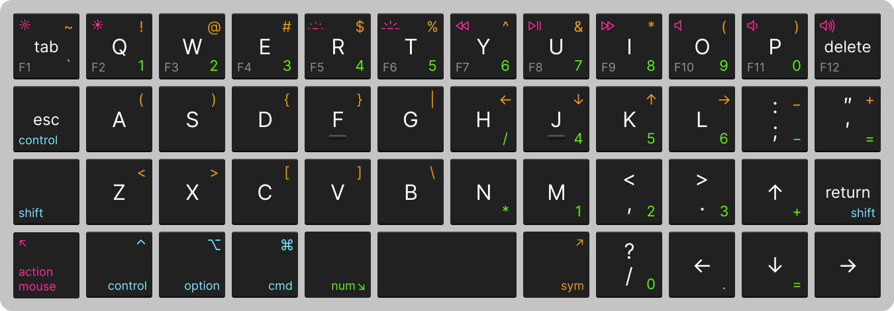
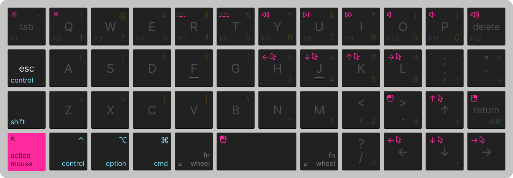

# 4×12 Ortholinear Keyboard

**Why 4×12 Ortholinear?**

* An ortholinear layout (e.g. a grid) aligns with how fingers move, reducing errors.
* The 4×12 layout keeps hands on the home row, encouraging better typing practices. All keys are only one key away from the home row.

**Design goals**

* Where possible, align to the existing apple keyboard layouts to reduce re-learning (ie. use Qwerty and inverted-T arrows).
* Bring keys to the hands instead of hands to the keys via *layer shifts*.
* All keys are only one layer shift away (except function keys). For keys not on the base layer that typically have a shifted key (ie. a number key with a symbol above it) place the shifted key on the next higher layer.
* Within a layer, keep the most used keys on the opposite hand from the shift key, enouraging two hand typing.

**Links**

* My board: [Boardsource Technik](https://boardsource.xyz/store/5ffb9b01edd0447f8023fdb2)
* Firmware: [QMK](https://qmk.fm/)

### How do you read these keys?

## What's a "layer shift"?

You know how when you hold down `shift` and all of the sudden new outputs come from your keys? That's a layer shift. Most keyboards have two layers: the base layer and the "shifted" layer.

Mobile keyboards offer an even better example. The iOS keyboard has four layers: the base lower-case layer, the "shifted" upper-case layer, the "number" layer, and within that the "symbol" layer.

Similarly, this keyboard features a number of layers, including the traditional "shifted" layer (not explicitly displayed here). The QMT firmware which powers the keyboard refers to the most common layers as "lowered" and "raised", corresponding to the "number" and "symbol" layers in this layout. Two additional layers: "action & mouse" and "function & wheel" are provided.

## Base Layer (Layer 0)

* Traditional Qwerty layout.
* Tab and Backspace in upper corners.
* Inverted-T arrow keys.
* Right shift and Enter are combined into one key: "Enter" when pressed, "Shift" when held.
* "Vim key" where capslock is typically found: "Esc" when pressed, "Control" when held.
* All other control keys may also be tapped once, and will act as if they were held for the next key pressed.

## Number Layer (Layer 1)

* Hold down the "lower" layer shift (found left of the space bar) to enter the number layer (or tap once, allowing the next key pressed to come from this layer).
* Top row becomes a traditional number row, including the `` ` `` key on the far left.
* Right side of the keyboard becomes a modified num pad, with the right hand's home row correctly positioned.
* Num pad flanked by arithmetic keys, as close as possible to a traditional num pad.
* The `=` key can be found right of the `-`, similar to a regular keyboard, and below the `+`, similar to a regular num pad.

## Symbol Layer (Layer 2)

* Hold down the "raise" layer shift (found right of the space bar) to enter the symbol layer (or tap once, allowing the next key pressed to come from this layer).
* Top row becomes a traditional symbol row (the "shift" of the number row).
* Left side of the keyboard becomes a set of paired symbols common in programming code.
  * The `<`, `>`, and `(`, `)` pairs are repeated here, reducing right hand strain.
* The `[`, `]`, `\` key sequence typically found right of `P` on a regular keyboard is found here over `C`, `V`, `B`. While this is a significant move from a regular keyboard, it reduces pinky straining and the sequence has been kept in order.
* The `_`, `+` keys are found "above" the `-`, `=` keys from the number layer pad, avoiding using multiple shifts at once.
* The `H`, `J`, `K`, `L` keys become "Vim style" arrow keys, allowing quick navigation without leaving the home row.

## Action & Mouse Layer (Layer 3)

* Hold down the "mouse" layer shift (found in the far right corner) to enter the action & mouse layer (or tap once, allowing the next key pressed to come from this layer).
* The top row becomes action keys, in the same arrangement as an apple keyboard.
* The arrow keys (including Vim style) become mouse movements, useful for quickly moving the mouse without leaving the keyboard.
* The spacebar, as well as the keys in the corners of the inverted-T arrow keys become mouse buttons.

## Function & Wheel layer (Layer 4)

* Hold down any two layer shift keys to enter the function layer.
* The top row becomes F1-F12 function keys.
* The arrow keys (including Vim style) become scroll wheel movements.
